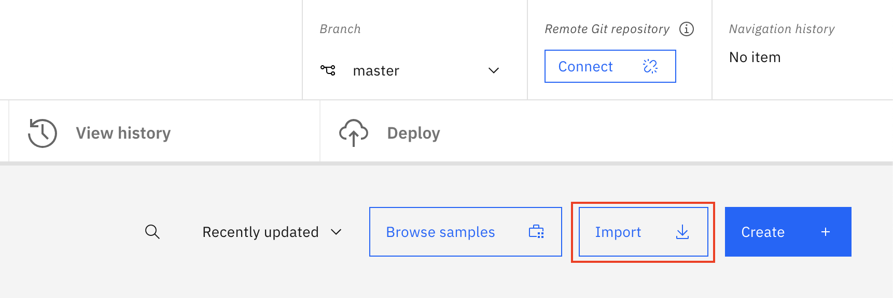
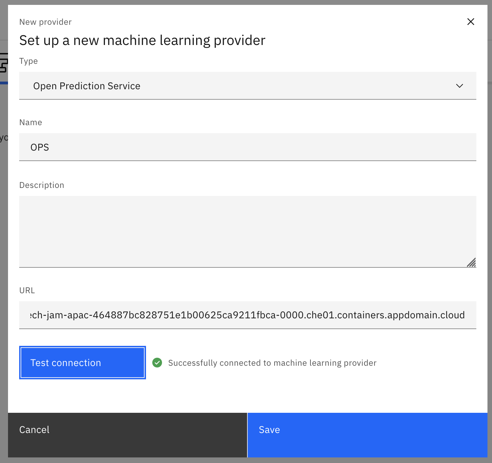
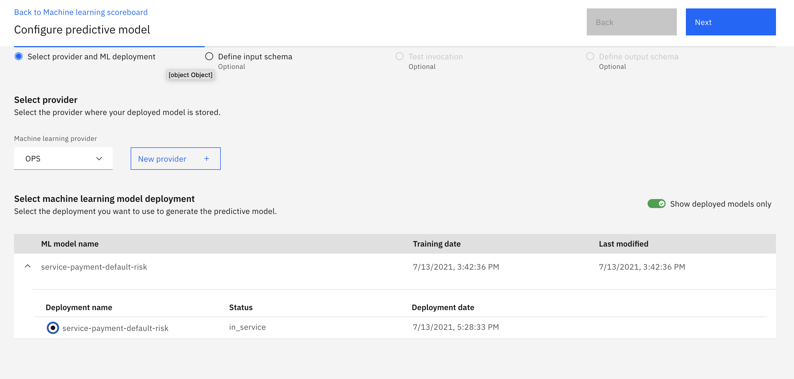
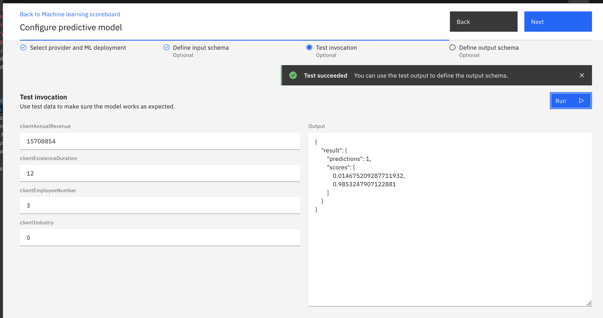
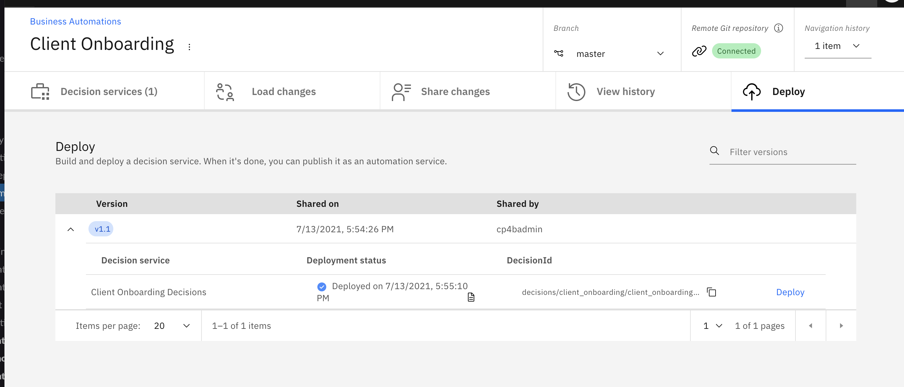

# Step 2 - Import the ADS Project

1. Download [ClientOnboardingDecisions.zip](Solution%20Exports/Automation%20Decision%20Services/ClientOnboardingDecisions.zip)

2. Create an empty GIT repo and get its URL and API Key

3. Open IBM Business Automation Studio

4. Click to the menu in the upper-left corner and go to `Design` --> `Business Automations`

5. Click on `Create` --> `Decision Automations`

6. Provide `Client Onboarding` as the project name and click `Create`

7. Once the editor loads, click on `Import` and import the previously downloaded file ClientOnboardingDecisions.zip into the project

   

8. Click on `Connect` and enter the references of the GIT repo previously created 

8. Click on `Connected` under `Remote Git repository`

9. In the `Machine learning providers` tab, click on `New`

10. In the dialog, select `Open Prediction Service` as the `Type`

11. Enter `OPS` as the name

12. Use the ADS ML Service (Open Prediction Service) URL in the `URL` field

13. Click on `Test Connection`

 

14. Click on `Save`

15. Go back to the `Client Onboarding` project

16. Open `Client Onboarding Decisions`

17. Go to the `Predictive models` tab and open `Machine learning scoreboard`

18. Click on `Connect` and select `OPS`

19. Expand the `service-payment-default-risk` ML model and select the `service-payment-default-risk` deployment

 


20. Click `Next` and go to `Test invocation`

21. Test the decision by entering the following values:

    - clientAnnualRevenue: 15708854
    - clientExistenceDuration: 12
    - clientEmployeeNumber: 3
    - clientIndustry: 0

22. Click on `Run`

23. Verify that the output matches the following:

    ```
    {
        "result": {
            "predictions": 1,
            "scores": [
                0.014675209287711932,
                0.9853247907122881
            ]
        }
    }
    ```


 

24. Click on `Next`

25. Click on `Generate from test output` then click `OK`

26. Click on `Apply` in the upper-right corner

27. Under `Share changes` at the top, click on the number of changes, select all and click `Share`

28.  In the `View history` tab, create a new version named `v1.1`

29. In the `Deploy` tab, expand `v1.1`, click on `Deploy` and wait for deployment to complete




30. Back in the studio, go to `Design` --> `Business Automations` -->`Decisions` and click on the `Client Onboarding` Decision project

31. Select the three-dot menu for `v1.1` and click on `Publish`

With that you have successfully imported the ADS solution. Next, [setup the RPA server](Step%203%20-%20RPA%20Server.md). 
**Note:** Setting up the RPA server is optional and only required if you want to demo the execution of the RPA bot. If you want to skip this step, go directly to [importing the Workflow solution](Step%204%20-%20Workflow%20Solution.md).

