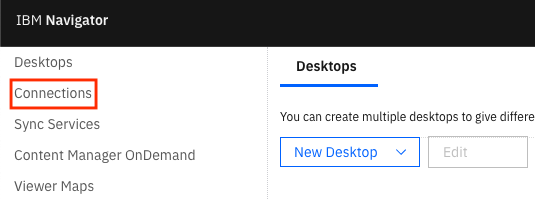
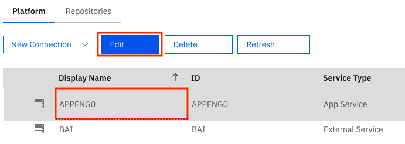
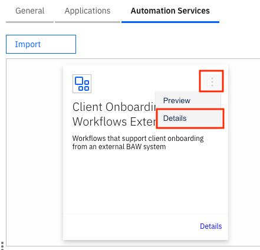
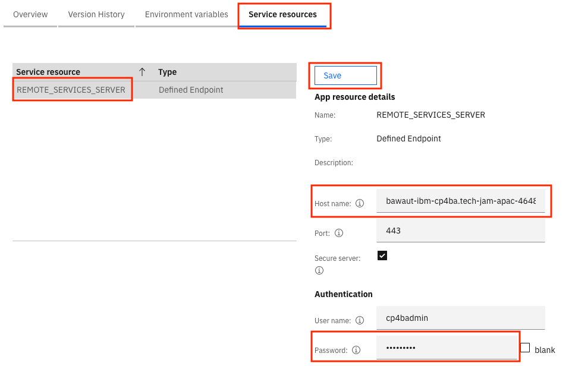
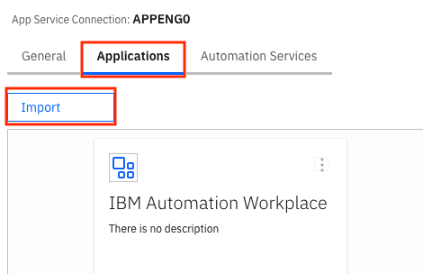
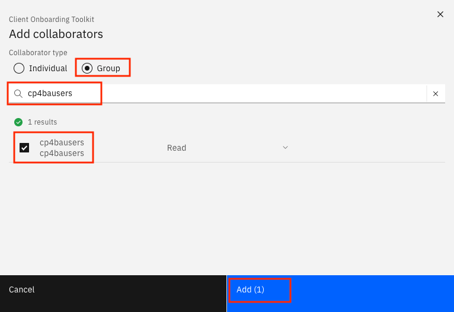
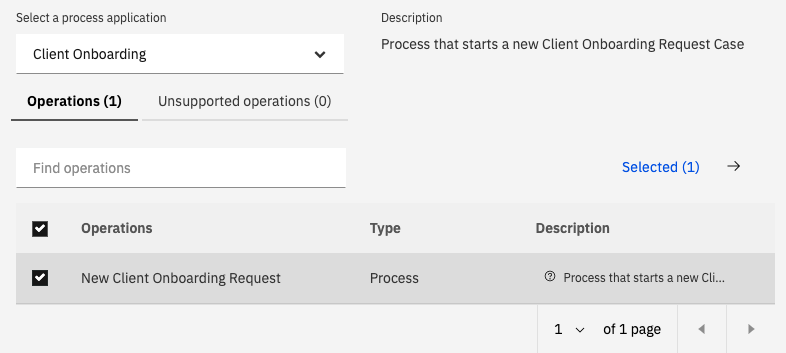

# Step 6 - Import the Business Automation Application app

### Pepare the environment for the end-to-end scenario

1. Download the contents of the [following folder](/Solution Exports/Navigator).

2. Login to the **Navigator admin desktop**.

3. Click on **Connections** in the menu on the left.

   

4. Select the the **APPENGO** connection and click on the **Edit** button.

   

5. Click on the the **Connect...** button.

6. Click on the **Automation Services** tab.

7. Click on the **Import** button.

   

8. Choose the previously downloaded file **Client_Onboarding_Workflows_External.zip** and click on the **Import** button. If a dialog pops up after import, you can close it.

9. Click on the 3-dot menu for the automation service and select **Details**.

   

10. Click on the **Service resources** tab and select the **REMOTE_SERVICE_SERVER** resource.

11. In the **Host name** field, enter the host name for your BAW server. It should look something like:
    `bawaut-ibm-cp4ba.....containers.appdomain.cloud`

    Note that  `http://` or `https://` isn't used as a part of the host name. You can find the host name for your system by looking up the Process Admin URL and copying the part without the `https://` and `/ProcessAdmin`

12. In the password field, enter the password for the admin user.

13. Click on the **Save** button.

    

14. Click on **Close** in the bottom-right corner.

15. Click on the **Applications** tab.

16. Click on the **Import** button.

    

17. Choose the the previously downloaded file **ClientOnboarding.zip** and click on the **Import** button. If a dialog pops up after import, you can close it.

18. Click on the 3-dot menu for the **Client Onboarding** applicaiton and select **Details**,

19. Click on the **Permissions** tab.

20. Click on the **Add Teams** button.

21. In the popup, enter **#** in the **Filter by Teams** field and hit **Enter**.

    

22. Select the **#AUTHENTICATED-USERS** team and click on the right-facing arrow to move the team to the **Selected** column.

23. Click on the **Add** button.

24. Click on the **Close** button.

25. Close the **APPENGO** and **Connections** tab at the top.

26. In the **Desktops** tab, click on the **Import** button.

27. Choose the the previously downloaded file **ICNExportedConfiguration.properties** and click on the **Import** button. You can close the summary dialog that pops up after the import is complete.

### Prepare a shared environment for labs

You only need to do these steps if your environment will be used to perform the labs associated with Client Onboarding.

1. Download the [application template twx file](https://github.com/IBM/cp4ba-client-onboarding-scenario/blob/main/Solution%20Exports/Business%20Automation%20Application/Client_Onboarding_Template.twx).

2. Login to **IBM Business Automation Studio**.

3. In the top-left corner, click on the menu icon and go to **Design** --> **Business applications**.

4. Click on the **Import** button.

5. Select the **Client_Onboarding_Template.twx** file that you previously downloaded and click on the **OK** button.

6. Once the import is complete, click on **Toolkits**.

7. Click on the tile for **Client Onboarding Toolkit** to open its details.

8. Click on the **Collaborators** tab.

9. Click on the **Add** button.

10. Select the **Group** radio button.

11. In the search box, enter the name of the shared user group (eg: cp4bausers).

12. Check the user group and click on **Add**.

    

13. In the top-left corner, click on the menu icon and go to **Design** --> **Business automations**.

14. Click on **Create** --> **External**.

15. Select **Business Automation Workflow** under **Select the connection type**.

16. Click on **Next**.

17. In the **Connection name** field, enter **External BAW System**.

18. In the **System URL** field, enter the host name of the BAW server that you previously used in navigator for the automation service but this time, include `https://`

19. Enter the admin credentials and click **Next**.

20. In the **Select a process application** dropdown, select **Client Onboarding**.

21. Select the checkbox for **New Client Onboarding Request**.

    

22. Click on **Next**.

23. In the **Name** field, enter **Client_Onboarding_Workflows_External**.

24. Click on **Publish**.

Once you have imported the app successfully, [import the Business Automation Insights data](/Step%207%20-%20Business%20Automation%20Insights.md).

