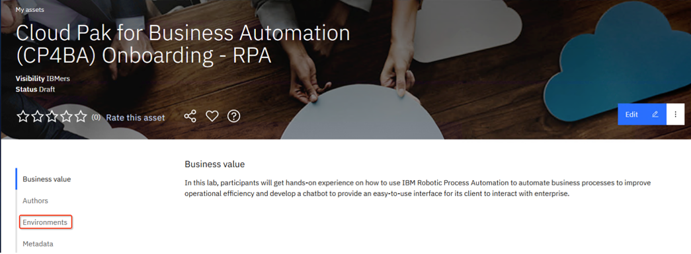
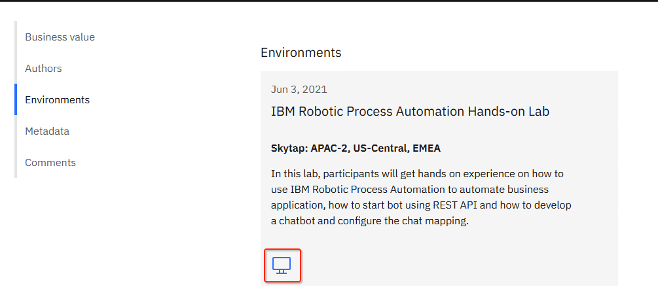
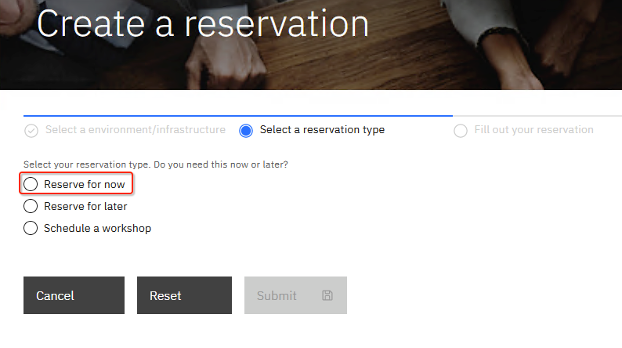
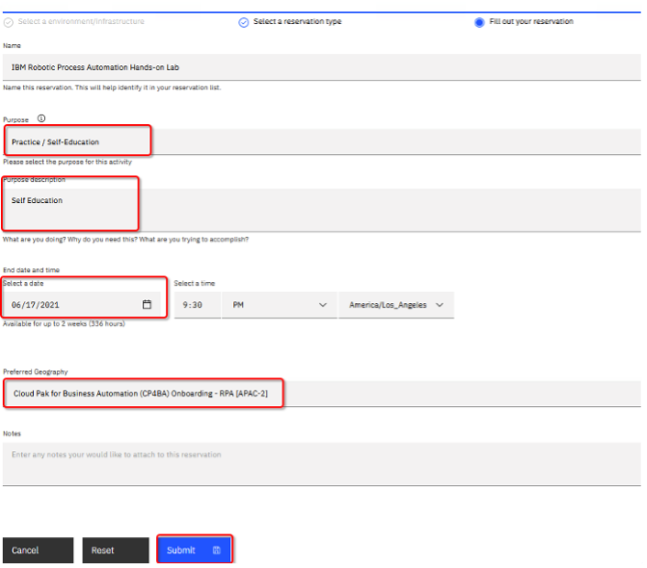
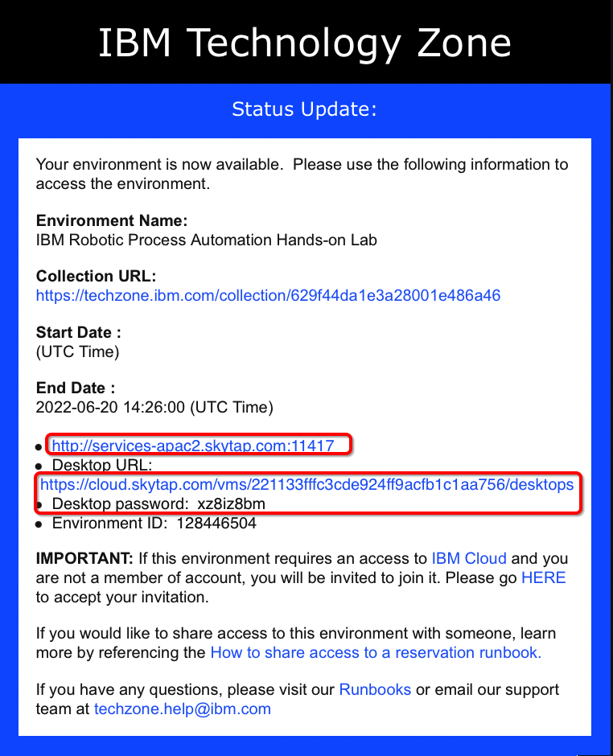
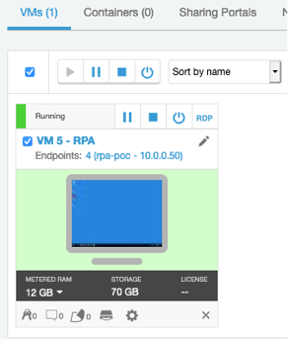
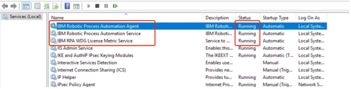

# Step 3 - Setup the RPA Server

**Note:** You only need to perform these steps if you want to demo the RPA execution. You can choose to skip the execution of the RPA bot when you import the Workflow solution.

1. Reserve an environment from [here](https://techzone.ibm.com/collection/cloud-pak-for-business-automation-cp4ba-rpa) using your IBMID.
   
2. Click **Environments** on the left panel, and then click **computer icon**.  
   
3. Click **Reserve for now**, then click **Submit**.  
   
4. On the reservation page, make the appropriate selections as below. Once done, click **Submit**.  
   
5. Once you have reserved an environment, you will receive an email with a link to access the management console including a password (**Desktop URL and Desktop password**). It also contains a **URL to access the IBM RPA Rest Service remotely** cycled in the first redbox, please copy the URL and change **HTTP** to **HTTPS**. This will be used in the Workflow solution.  
   
6. Click the **Desktop Access link** above to open your environment. When you are prompted to enter environment password, enter the desktop password above. Wait a few minutes, your environment will be started as below.  
   
7. Click **VM 5 – RPA** to open the RPA environment and check if IBM Robotic Process Automation Agent, IBM Robotic Process Automation Service, IBM RPA WDG License Metric Service are in running status.
   

Once you have setup the RPA server, [import the Workflow solution](Step%204%20-%20Workflow%20Solution.md).
