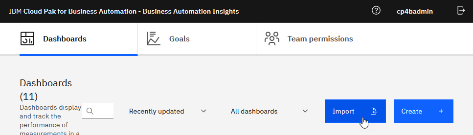
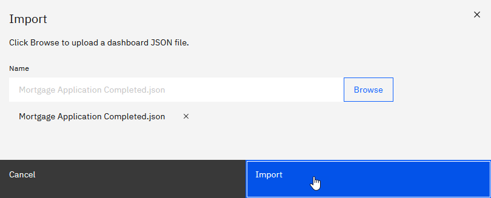
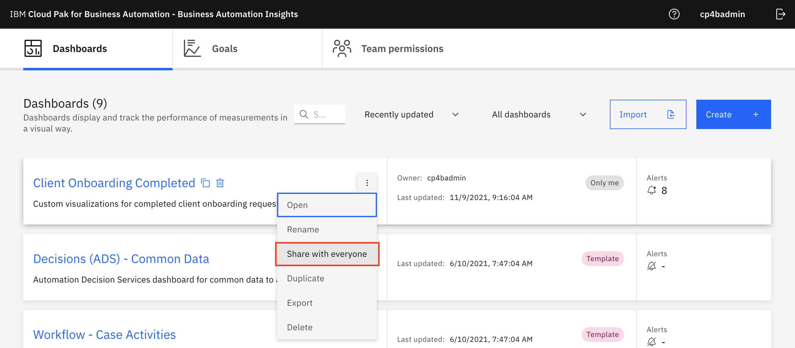

# Step 7 - Import the Business Automation Insights data

### Pepare the environment for the end-to-end scenario

**Note:** The data is currently based on a Mortgage Application solution

1. Download the contents of the following directory - [Business Automation Insights](Solution%20Exports/Business%20Automation%20Insights).

   In the commands below, replace `{esadmin}` with the elasticsearch admin user ID, replace `{espassword}` with the elastichsearch admin user password & replace `{eshost}` with the elasticsearch URL.

2. From the folder where you've downloaded the files, run the following command to import Case data.

   ```
   curl -k -XPOST -H 'Content-Type: application/json' -u {esadmin}:{espassword} '{eshost}/_bulk' --data-binary @case-data.json
   ```

3. Run the following command to import BPM data:

   ```
   curl -k -XPOST -H 'Content-Type: application/json' -u {esadmin}:{espassword} '{eshost}/_bulk' --data-binary @process-data.json
   ```

4. Run the following command to import ADS data:

   ```
   curl -k -XPOST -H 'Content-Type: application/json' -u {esadmin}:{espassword} '{eshost}/_bulk' --data-binary @ads-data.json
   ```

5. Open **Business Performance Center** and click **Import.**

> 

4.  Click **Browse.**

5.  Select **Client Onboarding Completed.json** (downloaded earlier) and click **Import**.

> 

### Prepare a shared environment for labs

1. Open **Business Performance Center**

2.	On **Client Onboarding Completed** dashboard select the **3-dot menu** and click **Share with everyone**.

> 

### Create and configure Goal

1. Follw the cnstruction included in this document - [Create and configure Goal](Solution%20Exports/Goal%20Setup%20Instructions.pdf).

### With that, you have successfully setup your environment with the Client Onboarding scenario.


