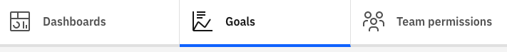
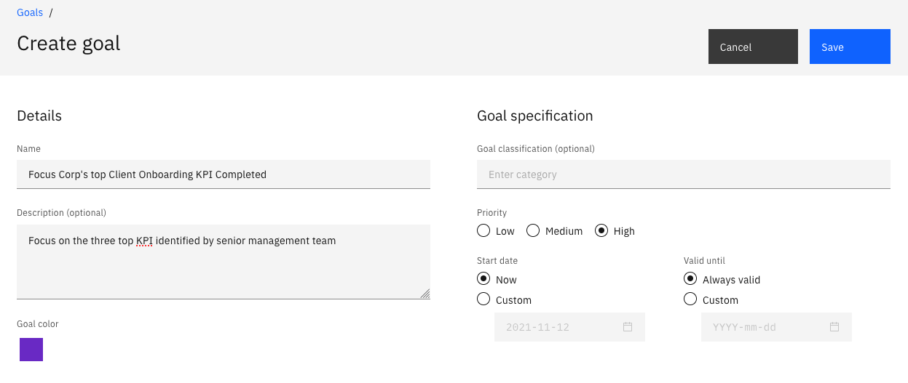
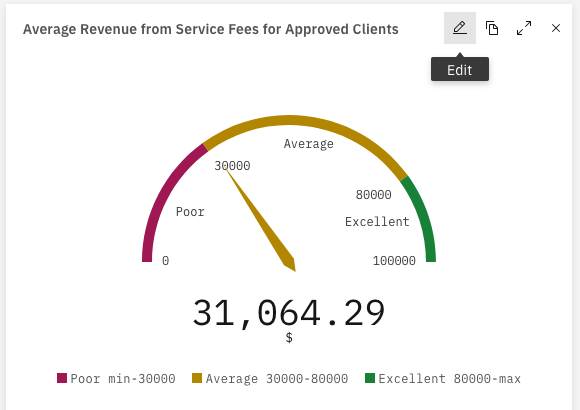
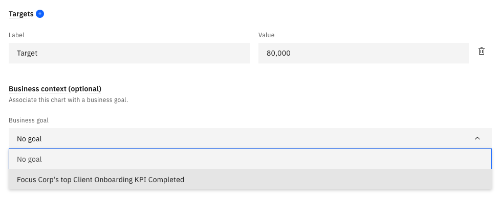
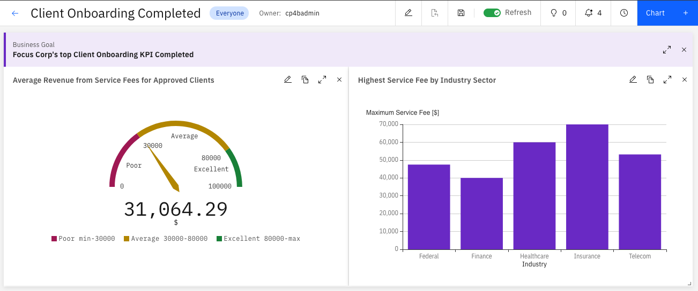

# Step 7 - Import the Business Automation Insights data

### Pepare the environment for the end-to-end scenario

1. Download the contents of the following directory - [Business Automation Insights](Solution%20Exports/Business%20Automation%20Insights).

   In the script below, replace `{esadmin}` with the elasticsearch admin user ID, replace `{espassword}` with the elastichsearch admin user password & replace `{eshost}` with the elasticsearch URL.

2. From the folder where you've downloaded the files, run the following script to import the data.

   ```
   ES_ADMIN={esadmin}
   ES_PASSWORD={espassword}
   ES_HOST={eshost}
   
   curl -k -XPOST -H 'Content-Type: application/json' -u ${ES_ADMIN}:${ES_PASSWORD} ${ES_HOST}/_bulk --data-binary @case-data.json
   curl -k -XPOST -H 'Content-Type: application/json' -u ${ES_ADMIN}:${ES_PASSWORD} ${ES_HOST}/_bulk --data-binary @process-data.json
   curl -k -XPOST -H 'Content-Type: application/json' -u ${ES_ADMIN}:${ES_PASSWORD} ${ES_HOST}/_bulk --data-binary @ads-data.json
   ```

3. Open **Business Performance Center** and click **Import.**

   
   
4. Click **Browse.**

5. Select **Client Onboarding Completed.json** (downloaded earlier) and click **Import**.

   

#### Create and configure goals

1. Open **Business Perfomance Center**

2. Click on the **Goals** tab

   

3. Click **Create**

   

4. For Name enter **Focus Corp's top Client Onboarding KPI Completed**

5. For Description enter **Focus on the three top KPI identified by senior management team**

6. For Priority select **High**

7. Click Goal color to **Purple**

8. Your Goal definition should look exactly like this:

   

9. Click **Save**

10. Click on the **Dashboards** tab

11. Open the **Client Onboarding Completed** dashboard

12. For the **Average Revenue from Services Fees for Approved Clients** visualization, click on the **Edit** icon.

    

13. For the **Business goal** field, select **Focus Corp's top Client Onboarding KPI** from the drop-down list

    

14. Click **Done**

15. Repeat steps 11-14 to add the same goal to the **Highest Service Fee by Industry Sector** visualization

    

### Prepare a shared environment for labs

1. Open **Business Performance Center**

2. On **Client Onboarding Completed** dashboard select the **3-dot menu** and click **Share with everyone**.

   


### With that, you have successfully setup your environment with the Client Onboarding scenario.


