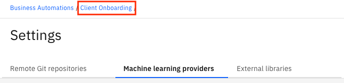
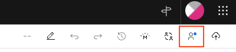

# Step 2 - Import the ADS Project

1. Download [ClientOnboardingDecisions.zip](Solution%20Exports/Automation%20Decision%20Services/ClientOnboardingDecisions.zip)

2. Create an empty GIT repo and get its URL and API Key

3. Open IBM Business Automation Studio

4. Click to the menu in the upper-left corner and go to `Design` --> `Business Automations`

5. Click on `Create` --> `Decision Automations`

6. Provide `Client Onboarding` as the project name and click `Create`

7. Once the editor loads, click on `Import` and import the previously downloaded file ClientOnboardingDecisions.zip into the project

8. Click on `Connect to Github` icon

    

9. Enter the references of the GIT repo previously created

10. Click on `Connect` in the top-right corner

11. Go to the `Machine learning providers` tab

12. Click on `New` in the top-right corner

13. In the dialog, select `Open Prediction Service` as the `Type`

14. Enter `OPS` as the name

15. Use the ADS ML Service (Open Prediction Service) URL in the `URL` field
    **Note:** This is the same URL you used for importing the predictive model without the `/docs` suffix at the end.

16. Click on `Test Connection`

17. Click on `Save`

18. Go back to the `Client Onboarding` project

19. Open `Client Onboarding Decisions`

20. Click on `Machine learning scoreboard`

21. Click on `Connect` and select `OPS` as the machine learning provider

22. Expand the `service-payment-default-risk` ML model and select the `service-payment-default-risk` deployment 


20. Click `Next` twice to `Test invocation`

21. Test the decision by entering the following values:

    - clientAnnualRevenue: 15708854
    - clientExistenceDuration: 12
    - clientEmployeeNumber: 3
    - clientIndustry: 0

22. Click on `Run`

23. Verify that the output matches the following:

    ```
    {
        "result": {
            "predictions": 1,
            "scores": [
                0.014675209287711932,
                0.9853247907122881
            ]
        }
    }
    ```


24. Click on `Next`
25. Click on `Generate from test output` then click `OK`. Verify that `predictions` and `scores` are added to the output schema.
26. Click on `Apply` in the upper-right corner
27. Under `Share changes` at the top, click on the number of changes
28. Click on `Share` and then `Share` again in the popup
29. In the `View history` tab, click on `Version +` and create a new version named `v21`
30. In the `Deploy` tab, expand `v21`, click on `Deploy` and wait for deployment to complete


30. Back in the studio, go to `Design` --> `Business Automations` -->`Decisions` and click on the `Client Onboarding` Decision project

31. Select the three-dot menu for `v21` and click on `Publish` and then click on `Publish` again to make the automation service available without restricting access.

Next, if you need the Capture part of the scenario, [configure the ADP Project](Step%203%20-%20ADP%20Project.md).
If you need don't need Capture but need RPA, you can [setup the RPA server](Step%204%20-%20RPA%20Server.md).
If you don't need the Capture or RPA part, you can go directly to [importing the Workflow solution](Step%205%20-%20Workflow%20Solution.md).
