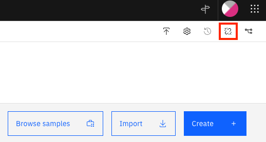

# Step 1 - Import the ADS Project

1. Download [ClientOnboardingDecisions.zip](Solution%20Exports/Automation%20Decision%20Services/ClientOnboardingDecisions.zip)

2. Create an empty GIT repo and get its URL and API Key

3. Open IBM Business Automation Studio

4. Click to the menu in the upper-left corner and go to `Design` --> `Business Automations`

5. Click on `Create` --> `Decision Automations`

6. Provide `Client Onboarding` as the project name and click `Create`

7. Once the editor loads, click on `Import` and import the previously downloaded file ClientOnboardingDecisions.zip into the project

8. Click on `Connect to Github` icon

    

9. Enter the references of the GIT repo previously created

10. Click on `Connect` in the top-right corner

11. Click on `Client Onboarding` in the top-left corner

12. Click on the `Share changes` tab
13. Click on `Share` and then `Share` again in the popup
14. In the `View history` tab, click on `Version +` and create a new version named `1.0.0`
15. In the `Deploy` tab, expand `1.0.0`, click on `Deploy` and wait for deployment to complete

30. Back in the studio, go to `Design` --> `Business Automations` -->`Decisions` and click on the `Client Onboarding` Decision project

31. Select the three-dot menu for `1.0.0` and click on `Publish` and then click on `Publish` again to make the automation service available without restricting access.

Next, if you need the Capture part of the scenario, [configure the ADP Project](Step%202%20-%20ADP%20Project.md).
If you need don't need Capture but need RPA, you can [setup the RPA server](Step%203%20-%20RPA%20Server.md).
If you don't need the Capture or RPA part, you can go directly to [importing the Workflow solution](Step%204%20-%20Workflow%20Solution.md).
