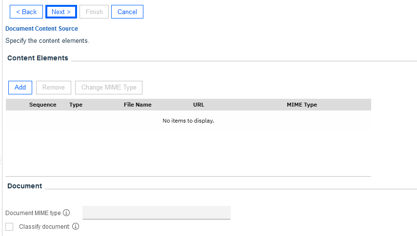

# Step 5 - Import objects into FileNet Content Manager

### Pepare the environment for the end-to-end scenario

Perform the following steps:

1. Login to ACCE. You can switch to english locale if needed by clicking on the persona icon in upper right corner, and select `Change Language and Locale Settings`.

2. Open the target object store, (eg: `BAWTOS` or `TARGET`), by clicking on it.
    
   
3. Create a new folder named `Client Documents` under the root folder.
   1. On the navigation area on the left side, open `Browse` and click on `Root folder`.
       
   2. Click on the `Actions` pulldown menu and click on `New Folder`.
       
   3. The `Define New Folders Dialog` opens on the right side. Set the Folder name to `Client Documents`. Then click on `Next >` two times, then on `Finish`.
       
   
4. In the `Client Documents` folder, create the documents from the table below (see instructions below the table on how to add a document):
   
   | Document                                                     | Document Title | Document Class  | Document Properties                                          |
   | ------------------------------------------------------------ | -------------- | --------------- | ------------------------------------------------------------ |
   | [Banking Information - Automation Elite Inc.pdf](Solution%20Exports/FileNet%20Content%20Manager/Client%20Documents/Banking%20Information%20-%20Automation%20Elite%20Inc.pdf) | Banking Information - Automation Elite Inc | Banking Information | Client Name: Automation Elite Inc. Account Number: 1179476345 |
   | [Certificate of Incorporation - Automation Elite Inc.pdf](Solution%20Exports/FileNet%20Content%20Manager/Client%20Documents/Certificate%20of%20Incorporation%20-%20Automation%20Elite%20Inc.pdf) | Certificate of Incorporation - Automation Elite Inc | Client Document | Client Name: Automation Elite Inc.                           |
   | [Utility Bill - Automation Elite Inc.pdf](Solution%20Exports/FileNet%20Content%20Manager/Client%20Documents/Utility%20Bill%20-%20Automation%20Elite%20Inc.pdf) | Utility Bill - Automation Elite Inc                 | Utility Bill        | Client Name: Automation Elite Inc. Service Address: 3974 Carson St, Lansing, MI 48911 |
   | [June Marie - Driver's License.png](Solution%20Exports/FileNet%20Content%20Manager/Client%20Documents/June%20Marie%20-%20Driver's%20License.png) | June Marie - Driver's License                       | Client Document     | Client Name: Automation Elite Inc.                      |
   | [Legacy Consulting - Banking Information.pdf](Solution%20Exports/FileNet%20Content%20Manager/Client%20Documents/Legacy%20Consulting%20-%20Banking%20Information.pdf) | Legacy Consulting - Banking Information             | Banking Information | Client Name: Legacy Consulting Account Number: 7250512345 |
   | [Legacy Consulting - Certificate of Incorporation.pdf](Solution%20Exports/FileNet%20Content%20Manager/Client%20Documents/Legacy%20Consulting%20-%20Certificate%20of%20Incorporation.pdf) | Legacy Consulting - Certificate of Incorporation | Client Document | Client Name: Legacy Consulting |
   
   1. In the navigation area, navigate to "Browse", and "Root Folder". Click on "Client Documents" to bring up the contents of the folder. From the opened "Client Documents" folder, invoke "New Document" from the Actions pulldown menu.
       
   2. In the New Document wizard, on the first page provide the document title, and select the Document Class from the table. Then click "Next".
       
   3. On the "Document Content Source" page, click on "Add" in the "Content Element" section. Use the popup window to upload the document. Click "Browse" and locate the document on your harddisk, then click on "Add Content" to close the dialog. Then click "Next" on the "New Document" wizard.
       
   4. On the next page, provide the property values, according to the table above. No further changes are required, so press "Next" until the final page, then "Finish" and then "Close".
   

### Prepare a shared environment for labs

If you are using an environment that will be shared by multiple users, it is important to disable certain permissions so that the objects defined for the Client Onboarding scenario are immuatable. Perform the following steps:

1. For the `Client Document` document class, update the security settings: remove the shared group (eg: cp4bausers) from the **Default Instance Security**. Update the **Security** and lower the access level for the cp4bausers group to `Modify properties`.
   1. On the Navigation area on the left side, open `Data Design`, `Classes`, `Document` and click on the `Client Document` class to bring up its properties on the right side.
       
   2. Select the `Default Instance Security` tab. Select the checkbox in front of the line with the shared user group (eg: cp4bausers) group and click on `Remove`. Then click on `Save`.
       
   3. Select the `Security` tab. Select the checkbox in front of the line with the shared user group (eg: cp4bausers) and click on `Edit...`. In the dialog, set the permission group to `Modify properties`, then click on `Ok`. Click on `Save` again on the `Client Document` class properties.
       
2. Expand the `Client Document` class on the left and repeat the previous step for the `Banking Information` and `Utility Bill` document classes.

With that, you have successfully imported the objects required for the solution into Filenet Content Manager. Next, [import the Business Automation Application into IBM Business Automation Navigator](Step%206%20-%20Business%20Automation%20Application.md).

