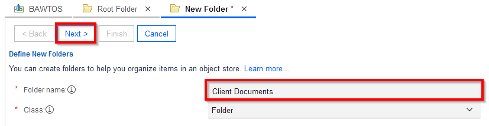
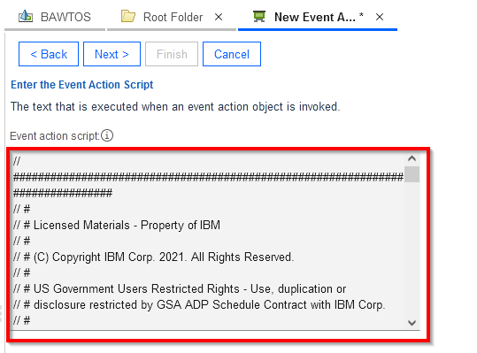
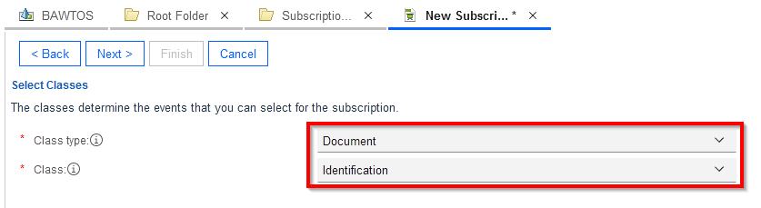
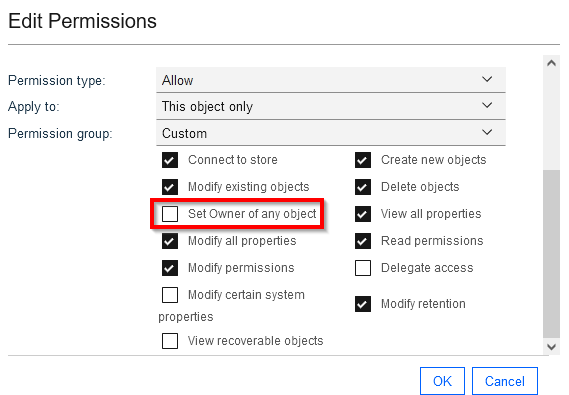

# Step 5 - Import objects into FileNet Content Manager

### Pepare the environment for the end-to-end scenario

Perform the following steps:

1. Login to ACCE. You can switch to english locale if needed by clicking on the persona icon in upper right corner, and select `Change Language and Locale Settings`.

2. Open the target object store, its name is `BAWTOS`, by clicking on it.
   <br/>
   
3. Create a new folder named `Client Documents` under the root folder.
   1. On the navigation area on the left side, open `Browse` and click on `Root folder`.
      <br/>
   2. Click on the `Actions` pulldown menu and click on `New Folder`.
      <br/>
   3. The `Define New Folders Dialog` opens on the right side. Set the Folder name to `Client Documents`. Then click on `Next >` two times, then on `Finish`.
      <br/>
   
4. In the `Client Documents` folder, create the documents from the table below:
   
   | Document                                                     | Document Class  | Document Properties                                          |
   | ------------------------------------------------------------ | --------------- | ------------------------------------------------------------ |
   | [Banking Information - Automation Elite Inc.pdf](/Solution%20Exports/FileNet%20Content%20Manager/Client%20Documents/Banking%20Information%20-%20Automation%20Elite%20Inc.pdf) | Client Document | Client Name: Automation Elite Inc.                           |
   | [Certificate of Incorporation - Automation Elite Inc.pdf](/Solution Exports/FileNet Content Manager/Client Documents/Certificate of Incorporation - Automation Elite Inc.pdf) | Client Document | Client Name: Automation Elite Inc.                           |
   | [June Marie - Driver's License.png](/Solution Exports/FileNet Content Manager/Client Documents/June Marie - Driver's License.png) | Identification  | Client Name: Automation Elite Inc.<br />Identification Number: S 100 100 100 100<br />First Name: June Marie<br />Last Name: Sample |
   | [Legacy Consulting - Banking Information.pdf](/Solution Exports/FileNet Content Manager/Client Documents/Legacy Consulting - Banking Information.pdf) | Client Document | Client Name: Legacy Consulting                               |
   | [Legacy Consulting - Certificate of Incorporation.pdf](/Solution Exports/FileNet Content Manager/Client Documents/Legacy Consulting - Certificate of Incorporation.pdf) | Client Document | Client Name: Legacy Consulting                               |
   
   
   
5. Create a `File Identification Event Action` using the below JavaScript.

   1. Open `Event, Action, Processes`. Right-click on `Event Actions` and select `New Event action` from context menu.
      <br/>
   2. The Name and Describe the Event Action dialog opens on the right. Set the name to `File Identification Event Action`, click `Next >`
      <br/>
   3. Select `Javascript`, click `Next >`
      <br/>
   4. Mark all text in the `Event Action Script` text box and remove it. Then go to the bottom of this page and copy the event action javascript. Paste the Javascript text from the bottom of this page into the `Event Action Script`text box, then click `Next >` then `Finish`.
      <br/>

6. For the `Identification` document class, add an event subscription `File Identification` and use the event action from the previous step.
   1. Open `Event, Action, Processes`. Right-click on `Subscriptions` and select `New Subscription` from context menu.
      <br/>
   2. Set the name to `File Identification Subscription`, click `Next >`
      <br/>   
   3. Set the class type to `Document`, and the class to `Identification`, click `Next >` twice
      <br/> 
   4. Select `Checkin Event` to trigger the subscription, click `Next >`
      <br/>  
   5. Set the event action to `File Identification Event Action`, click `Next >`
      <br/>
   6. Click on `Enable Subclasses`, click `Next` and `Finish`
      <br/>

### Prepare a shared environment for labs

Perform the following steps:

1. For the `BAWTOS` object store, update the security for the cp4bausers group. Remove the right to `set owner of every object` from the group, as users with this right will automatically see every document in the object store.
   1. Close all windows from the right side, and leave open only the Window showing the BAWTOS Object store properties. Select the `Security` tab.
      <br/>
   2. Mark the checkbox in front of the line for the `cp4bausers` group and click on `Edit...`
   3. Scroll down and unselect the right to `Set owner of any object`. Click on `Ok`
      <br/>
   4. Observe that the rights are now showing `Custom` set of rights in the Object Store security. Click on `Save`.
      <br/>
   
2. For the `Identification` document class, update the security settings: remove the cp4bausers from the **Default Instance Security**. Update the **Security** and lower the access level for the cp4bausers group to `Modify properties`.
   1. On the Navigation area on the left side, open `Data Design`, `Classes`, `Document` and click on the `Identification` class to bring up its properties on the right side.
      <br/>
   2. Select the `Default Instance Security` tab. Select the checkbox in front of the line with the `cp4bausers` group and click on `Remove`. Then click on `Save`.
      <br/>
   3. Select the `Security` tab. Select the checkbox in front of the line with the `cp4bausers` group and click on `Edit...`. In the dialog, set the permission group to `Modify properties`, then click on `Ok`. Click on `Save` again on the `Identification` class properties.
      <br/>
4. For the `Client Document` document class, update the security settings: remove the cp4bausers from the **Default Instance Security**. Update the **Security** and lower the access level for the cp4bausers group to `Modify properties`. Follow the same steps as before, just replace `Identification` class by `Client Document` class.


### Javascript for the File Identification Event Action

```javascript
// ###############################################################################
// #
// # Licensed Materials - Property of IBM
// #
// # (C) Copyright IBM Corp. 2021. All Rights Reserved.
// #
// # US Government Users Restricted Rights - Use, duplication or
// # disclosure restricted by GSA ADP Schedule Contract with IBM Corp.
// #
// ###############################################################################
importPackage(java.io);
importClass(java.lang.System);
importClass(java.lang.Integer);
importClass(Packages.com.filenet.api.engine.EventActionHandler);
importClass(Packages.com.filenet.api.util.Id);
importPackage(Packages.com.filenet.api.events);
importPackage(Packages.com.filenet.api.property);
importPackage(Packages.com.filenet.api.exception);
importPackage(Packages.com.filenet.api.core);
importPackage(Packages.com.filenet.api.constants);
importClass(Packages.com.filenet.api.query.SearchSQL);
importClass(Packages.com.filenet.api.query.SearchScope);
importClass(Packages.com.filenet.api.collection.IndependentObjectSet);

function onEvent(event, subscription) {
    // customize to some other string property symbolic name as needed
    var keyIdentifierName = "CO_ReferenceID";
    
    var os = event.getObjectStore();
    var id = event.get_SourceObjectId();

    // get document's key identifier value and net income which will be transfered into a case property
    var fe1 = new FilterElement(null, null, null, "Name " + keyIdentifierName, null);
    var pf = new PropertyFilter();
    pf.addIncludeProperty(fe1);

    var doc = Factory.Document.fetchInstance(os, id, pf);
    // TODO: It would be needed to find quote and other characters and handle properly, 
    // to prevent sql code injection attacks. This is Content Engine SQL though!
    var identifier = doc.getProperties().get(keyIdentifierName).getStringValue();
    
    // find case folder of same key identifier value
    var sqlStr = "SELECT [" + keyIdentifierName + "], [FolderName], [PathName], [CO_ClientName], [Id]" 
                + " FROM [CO_ClientOnboardingRequest] WHERE ([" 
                +   keyIdentifierName + "] = '" + identifier + "') AND ([CmAcmCaseState] < 3)";
    var sql = new SearchSQL(sqlStr);
    var ss = new SearchScope(os);
    var objectSet = ss.fetchObjects(sql, new Integer(1), null, null);
    var iter = objectSet.iterator();
    var count = 0;
    if (iter.hasNext()) {
        var folder = iter.next();
        
        // file the doc and save
        var drcr = folder.file(doc, AutoUniqueName.AUTO_UNIQUE,
                        doc.getProperties().getStringValue("Name"),
                        DefineSecurityParentage.DO_NOT_DEFINE_SECURITY_PARENTAGE);
        drcr.save(RefreshMode.NO_REFRESH);
        
        // Update Client Name property in the document. Need to load document again to prevent 
        // update sequence number errors.
        var clientName = folder.getProperties().get("CO_ClientName").getStringValue();
        var fe3 = new FilterElement(null, null, null, "Name CO_ClientName", null);
        var pf3 = new PropertyFilter();
        pf3.addIncludeProperty(fe3);
        var doc2 = Factory.Document.fetchInstance(os, id, pf3);
        doc2.getProperties().putValue("CO_ClientName", clientName);
        doc2.save(RefreshMode.NO_REFRESH);
    }
}

```
