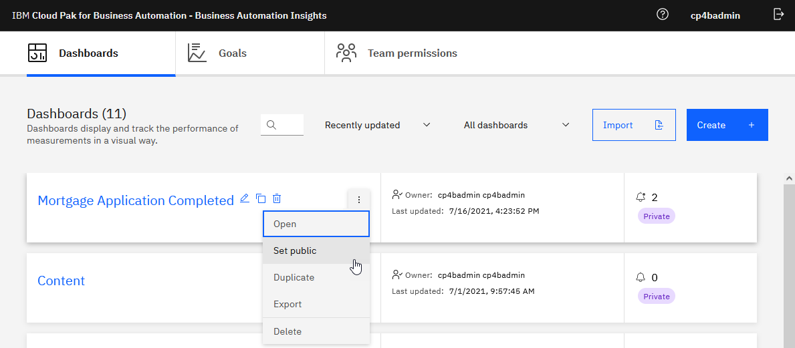

# Step 7 - Import the Business Automation Insights data

### Pepare the environment for the end-to-end scenario

**Note:** The data is currently based on a Mortgage Application solution

1. Run the following command to import Case data (replace `{esadmin}` with the elasticsearch admin user ID, replace `{espassword}` with the elastichsearch admin user password & replace `{eshost}` with the elasticsearch URL).

   ```
   curl -k -XPOST -H 'Content-Type: application/json' -u {esadmin}:{espassword} '{eshost}/_bulk' --data-binary @icmt.json
   ```

2. Run the following command to import BPM data:

   ```
   curl -k -XPOST -H 'Content-Type: application/json' -u {esadmin}:{espassword} '{eshost}/_bulk' --data-binary @processt.json
   ```
3.  Open **IBM Cloud Pak for Business Automation - Business Automation Insights** and click **Import.**

> 

4.  Click **Browse.**

5.  Select **Mortgage Application Complete.json** and click **Import**.

> 

6.  Optionally follow the instruction in **Lab Guide - Operational Intelligence - BAI - Build Business Performance Center Dashboard.pdf** to add and configure Goals.

 

### Prepare a shared environment for labs

1. Open **IBM Cloud Pak for Business Automation – Business Automation Insights**

2.	On **Mortgage Application Completed** dashboard select the **ellipses** and click **Set public**.

> 


###With that, you have successfully setup your lab for the end-to-end and preapred a shared environment for the CP4BA labs.


